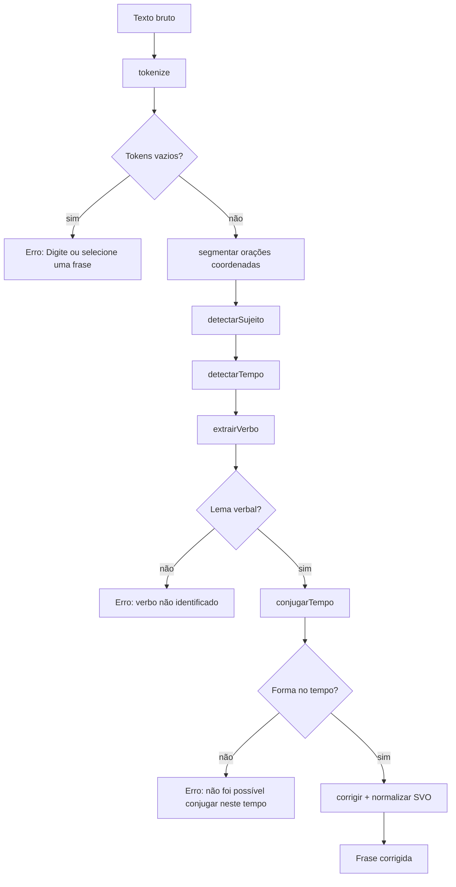
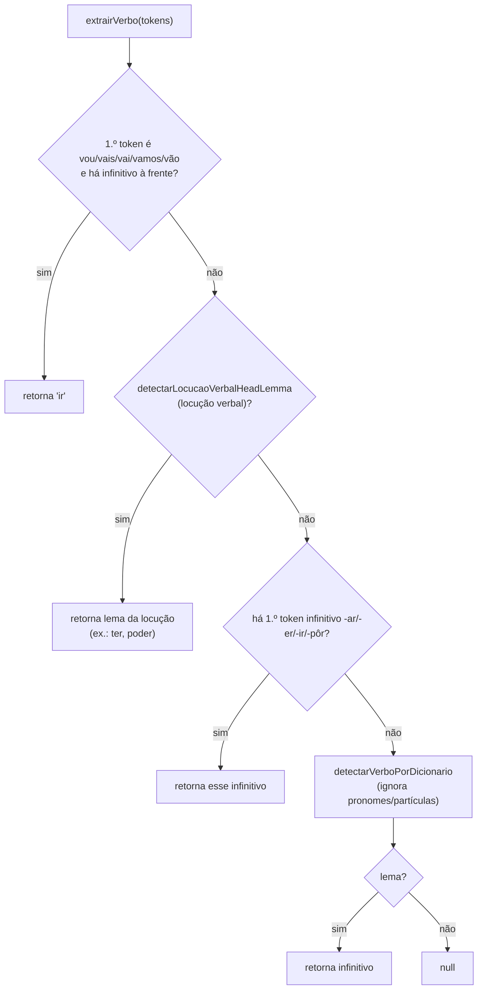
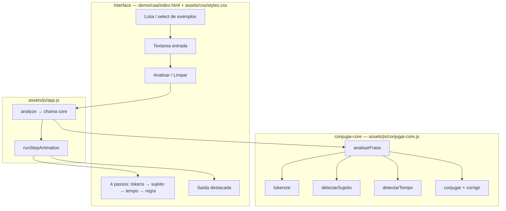
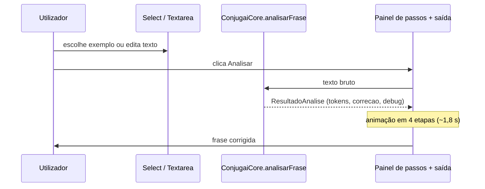

# ConjugAI — diagramas da lógica e da interface

Documentação em Mermaid. Pode pré-visualizar no VS Code/Cursor (extensão Mermaid) ou abrir `diagrama.html` na raiz do projeto no navegador. Nas páginas **`diagrama.html`** e **`demo/verbs/diagram.html`**, cada diagrama tem o botão **«Copiar código Mermaid»** (código fonte para colar noutro editor).

---

## 1. Pipeline de análise (`analisarFrase`)

Fluxo em `vendors/conjugai-core/index.ts`: desde o texto bruto até `correcao`. A UI chama `ConjugaiCore.analisarFrase` a partir de `assets/js/app.js` (`analyze`). Depois de `tokenize`, pode aplicar-se **segmentação por coordenação** (`oracao-composta.ts`; conectores típicos **«e»**, **«ou»**, **«mas»**, **«porém»**, **«então»** — com heurísticas para não partir sujeito composto *X e Y* / *X ou Y*); com mais de uma oração, o fluxo abaixo corre **por oração** e as correções juntam-se no fim.



### 1.1. `extrairVerbo` (lema verbal)

Detalhe de `conjugador.ts`, invocado dentro de `analisarFrase` após sujeito e tempo. **Ordem real no código:** (1) perífrase *ir* + infinitivo no início; (2) `detectarLocucaoVerbalHeadLemma` (*ter que/de*, *poder*/*dever* + infinitivo, *estar a*, *começar a*, *acabar de*, etc.); (3) primeiro token com forma de infinitivo `-ar/-er/-ir/-pôr`; (4) `detectarVerboPorDicionario`.



Diagrama interativo do núcleo (inclui **sujeito**, **tempo**, lema, `conjugar`, `corrigir`): `demo/verbs/diagram.html`.

---

## 2. Sujeito e tempo (detalhe)

**Sujeito** (`sujeito.ts`: primeiro `detectarSujeitoComposto`, depois regras simples; padrão composto **X e Y** ou **X ou Y** antes do verbo)

```mermaid
flowchart TD
  SC{Sujeito Composto<br/>X e Y ou X ou Y<br/>antes do verbo?} -->|sim| SC1[Nós / Vocês / Eles]
  SC -->|não| SPres{Pronome antes do verbo?}
  SPres -->|sim| S1[Pessoa conforme pronome]
  SPres -->|não| SPost{Pronome depois do verbo?}
  SPost -->|sim| S2[Pessoa conforme pronome<br/>Normaliza SVO]
  SPost -->|não| SFam{Eu + mamãe/papai?}
  SFam -->|sim| SN[Nós — 1ª plural]
  SFam -->|não| Basic{Pronome Básico Estático?}
  Basic -->|sim| S1
  Basic -->|não| SNome{Nome Próprio / Título?}
  SNome -->|sim| S3[3ª pessoa (ele/ela)<br/>Normaliza se pós-verbo]
  SNome -->|não| SDef[Padrão: Eu implícito]
```

**Tempo verbal** (`tempo.ts`: marcadores + override explícito por tag)

```mermaid
flowchart TD
  MAN{Tempo Manual (UI)?} -->|sim| TMAN[Prioridade Máxima]
  MAN -->|não| OVR{Tag de tempo explícito na frase?}
  OVR -->|sim| TEXP[Usa tempo explícito]
  OVR -->|não| J1{Tem "ontem" + "já"?}
  J1 -->|sim| PPC[Pretérito perfeito composto]
  J1 -->|não| J2{Tem "amanhã" + "já"?}
  J2 -->|sim| FC[Futuro composto]
  J2 -->|não| S1{Tem "se" / "quando" / "talvez" / "que"?}
  S1 -->|sim| SUB[Subjuntivo conforme marcador]
  S1 -->|não| T0{Tem amanhã?}
  T0 -->|sim| P1{1.º token vou/vai/vamos…?}
  P1 -->|sim| TN0[Presente]
  P1 -->|não| TF[Futuro do Presente]
  T0 -->|não| T1{Tem ontem?}
  T1 -->|sim| TP[Pretérito Perfeito]
  T1 -->|não| TN[Presente do indicativo]
```

O ramo **«que»** para subjuntivo **não** cobre o *que* de *ter que* / *ter de* + infinitivo: esse contexto é tratado em `tempo.ts` para não forçar subjuntivo indevido.

---

## 3. Arquitetura da aplicação (SPA)



---

## 4. Fluxo de dados na demonstração ao vivo


