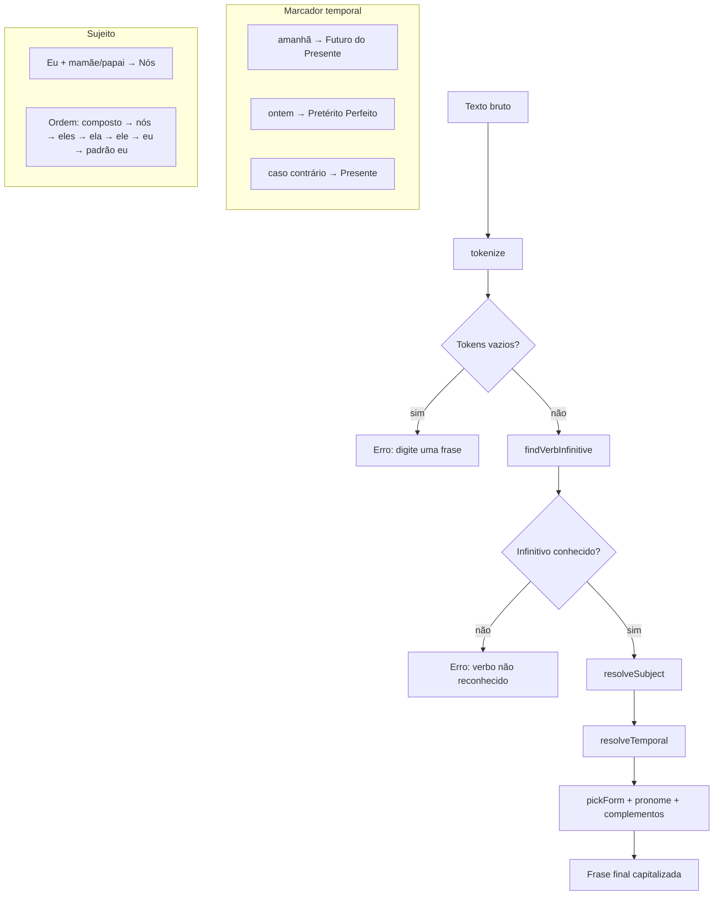
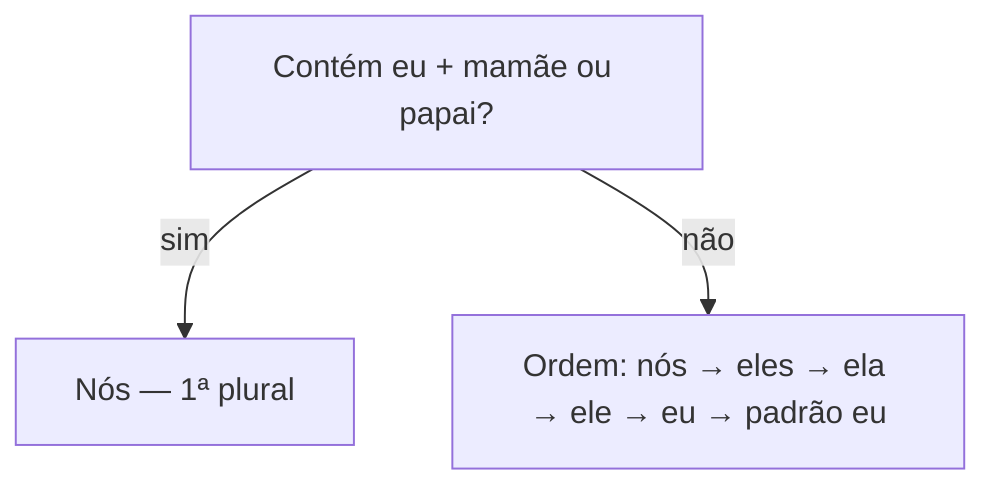
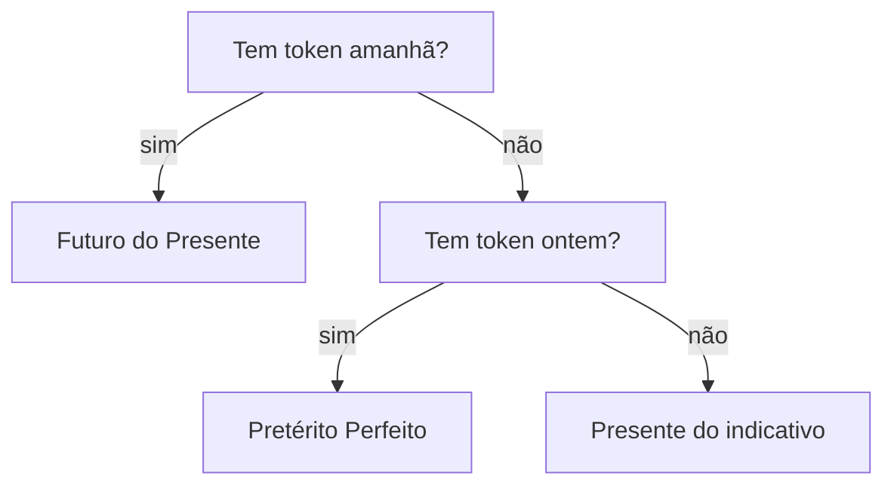

# ConjugAI — diagramas da lógica e do protótipo

Documentação em Mermaid. Pode pré-visualizar no VS Code/Cursor (extensão Mermaid) ou abrir `diagrama.html` na raiz do projeto no navegador.

---

## 1. Pipeline de análise (`analyze`)

Fluxo principal desde o texto bruto até a frase final.

---

## 2. Sujeito e tempo (detalhe)

**Sujeito**

**Tempo verbal**

---

## 3. Arquitetura do protótipo (SPA)

---

## 4. Fluxo de dados na demonstração ao vivo

