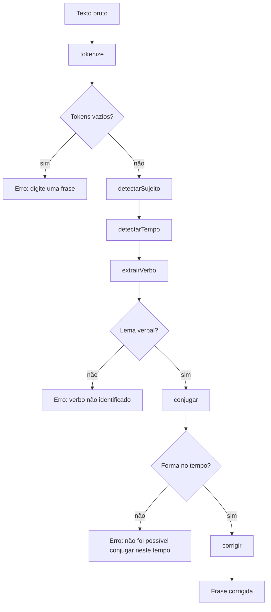
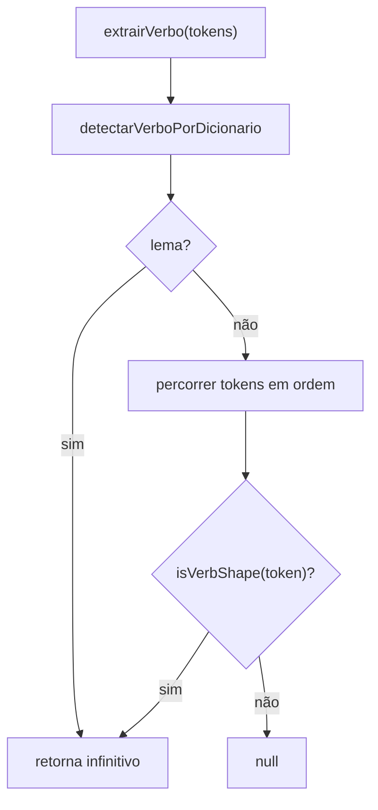
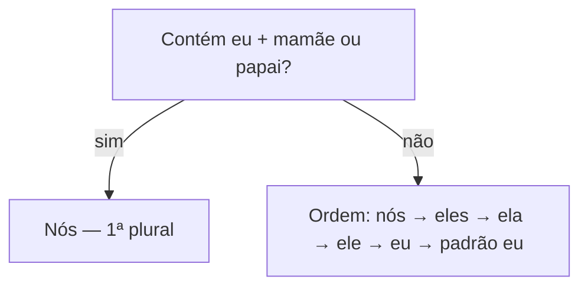
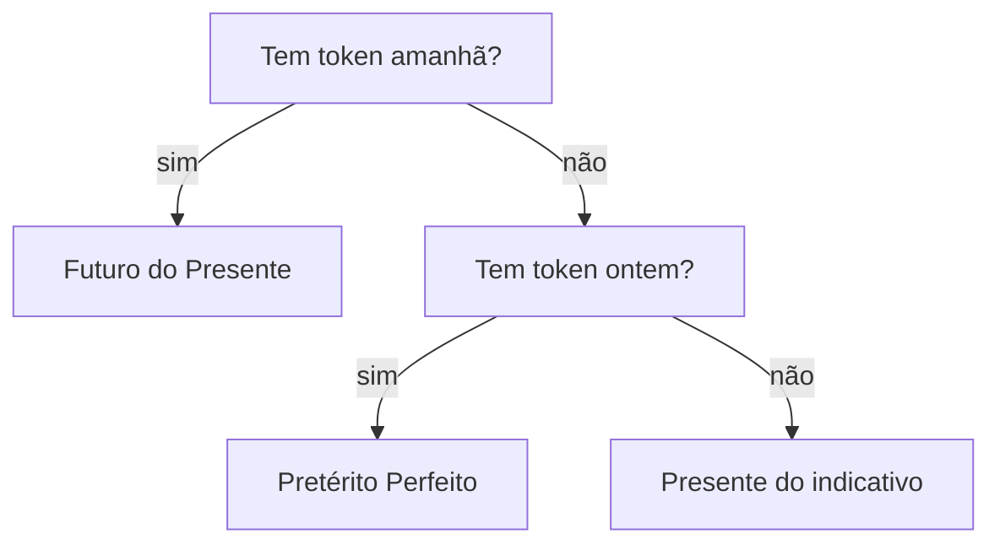

# ConjugAI — diagramas da lógica e do protótipo

Documentação em Mermaid. Pode pré-visualizar no VS Code/Cursor (extensão Mermaid) ou abrir `diagrama.html` na raiz do projeto no navegador.

---

## 1. Pipeline de análise (`analisarFrase`)

Fluxo em `vendors/conjugai-core/index.ts`: desde o texto bruto até `correcao`. A UI chama `ConjugaiCore.analisarFrase` a partir de `assets/js/app.js` (`analyze`).

### 1.1. `extrairVerbo` (lema verbal)

Detalhe de `conjugador.ts`, invocado dentro de `analisarFrase` após sujeito e tempo.

Diagrama interativo e restantes fluxos do núcleo: `vendors/conjugai-core/diagram.html`.

---

## 2. Sujeito e tempo (detalhe)

**Sujeito**

**Tempo verbal**

---

## 3. Arquitetura do protótipo (SPA)

---

## 4. Fluxo de dados na demonstração ao vivo

